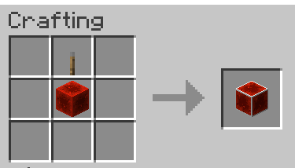

# Server Redstone Block

## Description

Ever had redstone contraptions break on you due to a server restart?

This block acts as a normal redstone block but the server admins can trigger a warning state and an off state at will.
This can give time for the contraptions to shut down gracefully before a server shutdown.

## Usage

### Player

As a player, you can use the block as a normal redstone block.

#### Crafting

You can craft it with a regular redstone block and a lever.

#### Redstone Output

- **On**: 15 power
- **Warning**: 1 power
- **Off**: 0 power

### Admin

To control the block, you need to have a permission level of 4.

When the server starts, the blocks always start in the ON state.

#### Commands

- `/srs on` : Sets the block to the on state
- `/srs warning` : Sets the block to the warning state
- `/srs off` : Sets the block to the off state
